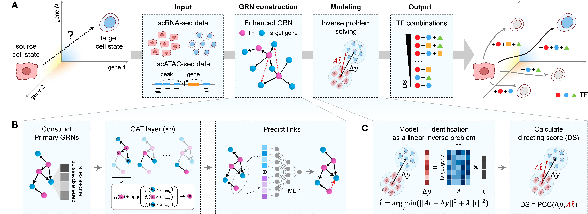

Overview
---------

TFcomb is a computational method that leverages single-cell multi-omics data to identify reprogramming TFs and TF combinations that can direct cell state transitions. We modeled the task of finding reprogramming TFs and their combinations as an inverse problem to enable searching for answers in very high dimensional space, and used Tikhonov regularization to guarantee the generalization ability of solutions. For the coefficient matrix of the model, we designed a graph attention network to augment gene regulatory networks built with single-cell RNA-seq and ATAC-seq data. Benchmarking experiments on data of human embryonic stem cells demonstrated superior performance of TFcomb against existing methods for identifying individual TFs.